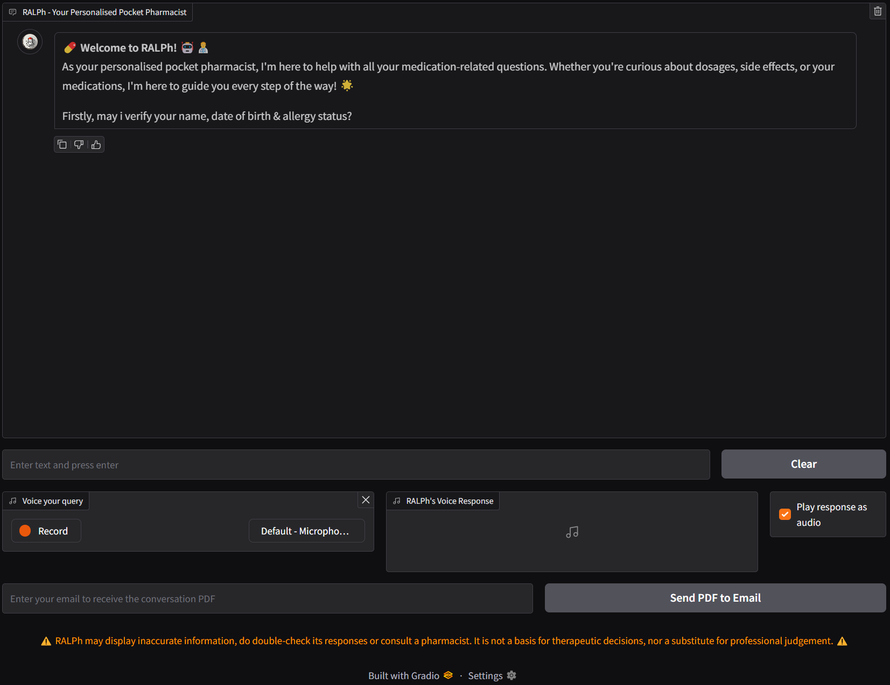

# 💊 RALPh (Retrieval Augmented LLM Pharmacist) 🤖👨‍⚕️ 

**Welcome to RALPh! - Your Personalised Pocket Pharmacist**

RALPh (Responsive AI Learning Pharmacist) is a conversational AI assistant designed to provide medication information and counselling services. This application uses large language models and a vector database to provide accurate & personalised medication information to users.

## Features

- **Intelligent Conversational Interface**: Engage in natural conversations about medications
- **Knowledge Base Integration**: Accesses an InterSystems IRIS vector database of medication information
- **User Verification**: Verifies patient details before providing personalized information
- **PDF Summary Generation**: Creates PDF summaries of conversations for patients to reference
- **Email Functionality**: Sends PDF summaries directly to users via email
- **Voice Interface**: Supports speech-to-text and text-to-speech for accessible interactions



## Components

The application is organized into modular components:

1. **Models**: Configuration of OpenAI language models
2. **Knowledge Base**: InterSystems IRIS Vector database connection and search functionality
3. **Chat System**: Core chat processing, memory management, and response generation
4. **Utilities**: PDF summary generation, email functionality, and speech processing
5. **User Interface**: Gradio web interface for user interaction


# Installation

## Prerequisites

- Python installation
- InterSystems IRIS database (running in Docker) - refer to "InterSystems Database Setup" section below
- API keys for OpenAI and ElevenLabs
- Set up Gmail SMTP - refer to [link](https://support.google.com/a/answer/176600?hl=en). This is required for the send email functionality to work.

## Environment Setup

1. Clone the git repository

2. Navigate to your Project Directory
```
cd path/to/your/project
```

3. Create a new virtual environment
```
python -m venv ralph-chatbot-env
```

- Note: you give any name to your virtual environment, the example used here is `ralph-chatbot-env`
- However, do remember to include the files/folders to your virtual environment in `.gitignore` so that it will not be committed

4. Activate the virtual environment 
- Windows:
```
.\ralph-chatbot-env\Scripts\activate
```
- macOS/Linux:
```
source ralph-chatbot-env/bin/activate
```

5. Install packages / dependencies
```
pip install -r requirements.txt
```

6. Create a `.env` file (within the main directory) containing the following:
```
OPENAI_API_KEY=your_openai_key
ELEVENLABS_API_TOKEN=your_elevenlabs_key

# Email configuration (Gmail SMTP details)
EMAIL_SENDER=your_email@gmail.com
EMAIL_PASSWORD=your_app_password
```
- Refer to [link](https://support.google.com/a/answer/176600?hl=en) on setting up of Gmail SMTP.


## InterSystems Database Setup
Reference (InterSystems Repo): https://github.com/intersystems-community/hackathon-2024/tree/main

Prerequisites: Ensure that you have Docker installed on your local computer & is running for the commands below to work.

**Note: This setup needs to be done only once. After the initial setup, you just need to ensure that the Docker container is running before executing any code.**

1. Install IRIS Community Edtion in a container. This will be your SQL database server.
    ```Shell
    docker run -d --name iris-comm -p 1972:1972 -p 52773:52773 -e IRIS_PASSWORD=demo -e IRIS_USERNAME=demo intersystemsdc/iris-community:latest
    ```
   After running the above command, you can access the System Management Portal via http://localhost:52773/csp/sys/UtilHome.csp.

2. Install Intersystem's DB API driver . Choose one option, based on your Operating System. Usage of the driver is subject to [`Terms and Conditions`](https://www.intersystems.com/IERTU)

    Mac OS:

    ```Shell
    pip install ./install/intersystems_irispython-5.0.1-8026-cp38.cp39.cp310.cp311.cp312-cp38.cp39.cp310.cp311.cp312-macosx_10_9_universal2.whl
    ```

    Windows AMD64:

    ```Shell
    pip install ./install/intersystems_irispython-5.0.1-8026-cp38.cp39.cp310.cp311.cp312-cp38.cp39.cp310.cp311.cp312-win_amd64.whl
    ```

3. To populate the Intersystems Vector DB, navigate to `/dataset/build_IRIS_knowledge_base.ipynb`. Open the notebook & execute all the cells.

4. Ensure that the Docker container is active & running.


## Running the Application

**NOTE: ensure that your venv and database are fully set up & active**

Start the application with:
```
python main.py
```

For a shareable link:
```
python main.py --share
```

#### Demo patient & RALPh verification
As our prototype is not yet integrated with any electronic medical system, a sample (fictional) patient is coded in `config.py`.

For the first conversation with RALPh, you will be asked to provide the patient's name, date of birth & allergy status for verification (refer to demo screenshot above). 

The default sample patient details are:
```
Name: Helen Lee
Date of Birth: 9 August 1945
Allergy: Paracetamol (Panadol)
```

## License

Apache 2.0

## RALPh Team Members

1. Adison Goh, Data Scientist (Correspondence: [LinkedIn](www.linkedin.com/in/adisongoh))
2. Lee Hui, Data Scientist
3. Goh Jian Wei, Operations Pharmacist
4. Yeo Jia Qi, Clinical Pharmacist
5. Wu Yang, Operations Manager